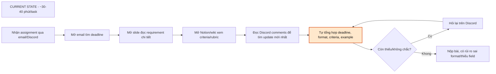
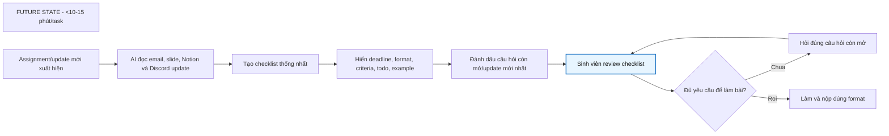

# 2. Problem Statement

## Group convergence

| Cluster | Candidate examples | Pattern chung |
|---|---|---|
| Tổng hợp thông tin | Dev Weekly Report, Progress & Blocker Summary  | Gom thông tin từ nhiều nguồn rồi review |
| Lên kế hoạch, xử lý | Priority Order, Risk Management, Late Blocker Detection | Lên kế hoạch cho dự án, xử lý các biến cố |
| Cập nhật | Scattered Team Updates, Repetitive Data Entry Inefficiency  | Cập nhật các chức năng của dự án |
| Tìm kiếm thông tin | Multi-Channel Communication Overhead, Lost in Discord Logs | Tìm kiếm thông tin từ các kênh khác nhau |

## Shortlist và score

| Candidate | Actor rõ | Workflow rõ | Pain có evidence | Impact đo được | Làm trong lab | So sánh R/W/A được | Nhóm hiểu domain | Tổng |
|---|---:|---:|---:|---:|---:|---:|---:|---:|
| Multi-Channel Communication Overhead | 5 | 5 | 4 | 5 | 4 | 5 | 5 | 33 |
| Dev Weekly Report | 4 | 4 | 4 | 4 | 3 | 4 | 5 | 28 |
| Progress & Blocker Summary | 4 | 5 | 3 | 5 | 5 | 4 | 4 | 30 |

Nhóm chọn: **Multi-Channel Communication Overhead**.

Vì sao chọn:

- Requirement thường nằm ở nhiều nơi khác nhau như email, slide, Notion, Discord hoặc chat nhóm, khiến người thực hiện phải mất thời gian tìm kiếm và đối chiếu thông tin.
- Đây là vấn đề có impact lớn và xảy ra thường xuyên đối với sinh viên hoặc thành viên dự án khi nhận task.
- Pain point cụ thể và dễ đo lường
- Bài toán phù hợp với AI vì AI có thể đọc nhiều nguồn dữ liệu, tổng hợp requirement, trích xuất checklist và highlight những phần quan trọng cho người dùng

Vì sao không chọn các bài khác:

- Dev Weekly Report: chỉ diễn ra một lần mỗi tuần, phạm vi ảnh hưởng nhỏ hơn.
- Review PRD: Bài toán này phụ thuộc vào việc dữ liệu tiến độ đã được cập nhật đầy đủ và chính xác.

# Quick validation

Nhóm hỏi nhanh 3 sinh viên và 3 thành viên dự án đã từng nhận task từ nhiều nguồn khác nhau.

| Nguồn               | Số người | Tín hiệu xác nhận                                                                                                                      | Tín hiệu phản bác                                                           | Nhóm sửa problem thế nào                                                                                          |
| ------------------- | -------: | -------------------------------------------------------------------------------------------------------------------------------------- | --------------------------------------------------------------------------- | ----------------------------------------------------------------------------------------------------------------- |
| Quick interview     |        3 | 3/3 người cho biết requirement thường nằm ở nhiều nơi như Discord, Notion, slide và chat nhóm; đều từng phải hỏi lại vì sợ sót yêu cầu | 1 người cho rằng nếu dự án có quy trình tốt thì chỉ cần đọc Notion là đủ    | Thu hẹp problem: không phải "quản lý toàn bộ giao tiếp", mà là "tổng hợp requirement của một task từ nhiều nguồn" |
| Mini poll trong lớp |        6 | 5/6 từng mất hơn 20 phút để tìm và đối chiếu thông tin trước khi bắt đầu làm bài tập hoặc project                                      | Một số người cho rằng với task đơn giản thì chỉ cần checklist hoặc template | Thêm non-AI alternative: chuẩn hóa nơi lưu requirement và checklist task                                          |

**Insight sau validation:**

```text
Pain thật không nằm ở việc tìm kiếm từng nguồn thông tin riêng lẻ.
Pain nằm ở việc phải tự tổng hợp và đối chiếu nhiều nguồn rời rạc để hiểu đầy đủ requirement của một task, dẫn đến mất thời gian và dễ bỏ sót thông tin quan trọng.
```

## Research giải pháp

Nhóm tìm các hướng đã có sẵn, không giả định phải tự build từ đầu.

| Nguồn / tool / case                   | Link                                                                                             | Họ giải quyết phần nào?                               | Điểm mạnh                                                                      | Khoảng trống / rủi ro                                                                                 | Bài học cho nhóm                                                                               |
| ------------------------------------- | ------------------------------------------------------------------------------------------------ | ----------------------------------------------------- | ------------------------------------------------------------------------------ | ----------------------------------------------------------------------------------------------------- | ---------------------------------------------------------------------------------------------- |
| Slack AI                              | https://slack.com/help/articles/25076892548883-Guide-to-AI-features-in-Slack                     | Summary và search trong channel, thread, chat history | Giúp người dùng nhanh chóng nắm được nội dung chính của các cuộc thảo luận dài | Chỉ xử lý dữ liệu trong Slack, không tổng hợp được Email, Notion, LMS hoặc Discord                    | AI tóm tắt tốt một nguồn dữ liệu nhưng chưa giải quyết được bài toán đa nguồn                  |
| Microsoft 365 Copilot                 | https://learn.microsoft.com/en-us/microsoft-365-copilot/microsoft-365-copilot-overview           | Tổng hợp thông tin từ Email, Teams, tài liệu Office   | Có khả năng gom nhiều nguồn thông tin và tạo bản tóm tắt thống nhất            | Chủ yếu hoạt động trong hệ sinh thái Microsoft; dữ liệu ngoài hệ sinh thái có thể không truy cập được | Giá trị lớn nằm ở việc hợp nhất dữ liệu trước khi tóm tắt                                      |
| Single Source of Truth (Notion / LMS) | https://www.atlassian.com/work-management/knowledge-sharing/documentation/single-source-of-truth | Chuẩn hóa nơi lưu requirement và thông tin chính thức | Giảm đáng kể việc tìm kiếm và đối chiếu giữa nhiều nền tảng                    | Phụ thuộc vào việc mọi người cập nhật đầy đủ và đúng nơi quy định                                     | Không phải mọi pain point đều cần AI; đôi khi quy trình tốt đã giải quyết được phần lớn vấn đề |
| Fellow AI Meeting Notes               | https://fellow.ai/features/ai                                                                    | Tự động tạo meeting notes, action items và summary    | Biến lượng lớn nội dung trao đổi thành danh sách công việc rõ ràng             | Chỉ hoạt động trên dữ liệu cuộc họp, không xử lý toàn bộ nguồn thông tin của một task                 | Pattern hữu ích là AI tạo draft checklist, con người review trước khi sử dụng                  |

Research takeaway:

```text
Các giải pháp hiện tại chủ yếu giải quyết một phần của bài toán:

- Hoặc giảm phân mảnh bằng quy trình (Single Source of Truth).
- Hoặc dùng AI để tóm tắt dữ liệu sau khi đã thu thập được (Slack AI, Copilot).

Khoảng trống còn lại là giúp sinh viên hiểu đầy đủ một task khi requirement nằm rải rác ở Discord, Email, Slide, LMS và Notion, đồng thời tạo ra checklist, deadline và các điểm cần làm rõ trong một nơi duy nhất.
```
# Workflow before/after

Nội dung workflow:


Fallback:
AI bỏ sót hoặc hiểu sai requirement → sinh viên mở lại Email, Slide, Notion hoặc Discord để kiểm tra nguồn gốc và tự tổng hợp thủ công.

Bottleneck mới:
Sinh viên review checklist và xác nhận requirement trước khi làm bài. Đây là bottleneck chấp nhận được vì người thực hiện vẫn phải chịu trách nhiệm hiểu đúng yêu cầu trước khi nộp.
```

Before/after impact:

| Metric                    |                                   Trước |                       Sau kỳ vọng | Ghi chú                                 |
| ------------------------- | --------------------------------------: | --------------------------------: | --------------------------------------- |
| Tổng thời gian hiểu task  |                              30-40 phút |                       <10-15 phút | Target chính                            |
| Số nguồn cần đọc thủ công | 4 nguồn (Email, Slide, Notion, Discord) |                         0-1 nguồn | Chỉ kiểm tra lại khi cần                |
| Bước thủ công             |                                     8/9 |                               2/8 | Chủ yếu còn review và thực hiện         |
| Bottleneck chính          |  Tự tổng hợp requirement từ nhiều nguồn |           Review checklist AI tạo | Human boundary                          |
| Số lần hỏi lại            |                            1-2 lần/task |            Chỉ khi còn câu hỏi mở | Hỏi đúng vấn đề thay vì hỏi chung chung |
| Risk chính                |          Bỏ sót update hoặc requirement | AI hiểu sai hoặc bỏ sót thông tin | Cần hiển thị nguồn tham chiếu           |
| Kết quả đầu ra            |                 Requirement nằm rải rác |          Một checklist thống nhất | Dễ bắt đầu làm bài hơn                  |

Điểm đáng chú ý là AI **không thay thế quyết định của sinh viên**, mà chỉ thay thế bước bottleneck hiện tại là:

```text
"Tự tổng hợp deadline + format + criteria + example
từ nhiều nguồn khác nhau"
```

Đây chính là bước đang tốn nhiều thời gian nhất trong workflow hiện tại.

## Problem Statement v0

| Field              | Nội dung                                                                                                                                                                                                                                          |
| ------------------ | ------------------------------------------------------------------------------------------------------------------------------------------------------------------------------------------------------------------------------------------------- |
| **Actor**          | Sinh viên nhận assignment từ giáo viên hoặc trợ giảng; lớp trưởng/nhóm trưởng là actor phụ thường chia sẻ thêm update và nhắc deadline.                                                                                                           |
| **Workflow**       | Khi có assignment mới, sinh viên phải mở Email để xem deadline, đọc Slide để hiểu requirement, mở Notion/Wiki để xem rubric và criteria, đọc Discord để tìm update mới nhất, sau đó tự tổng hợp tất cả thông tin trước khi bắt đầu làm bài.       |
| **Bottleneck**     | Bước tự tổng hợp deadline, format, criteria, example và các update mới nhất từ nhiều nguồn khác nhau mất khoảng 10-15 phút và dễ bỏ sót thông tin quan trọng.                                                                                     |
| **Impact**         | Tổng thời gian để hiểu đầy đủ một task thường mất 30-40 phút; sinh viên phải hỏi lại nhiều lần; có rủi ro nộp sai format, thiếu field hoặc bỏ sót requirement.                                                                                    |
| **Success Metric** | Giảm thời gian hiểu task từ 30-40 phút xuống dưới 10-15 phút; giảm số lần phải hỏi lại về requirement; giảm tỷ lệ nộp sai format hoặc thiếu yêu cầu.                                                                                              |
| **Boundary**       | Không tự quyết định requirement; không tự trả lời các câu hỏi học thuật; không tự gửi bài hoặc thay sinh viên đưa ra quyết định cuối cùng; chỉ tổng hợp thông tin từ các nguồn được cung cấp và hiển thị nguồn tham chiếu để người dùng kiểm tra. |


## Rule / Workflow / Agent

| Mức          | Phương án                                                                                                                                       | Khi nào đủ                                                                                                  | Rủi ro                                                                                                          | Chọn?                                                               |
| ------------ | ----------------------------------------------------------------------------------------------------------------------------------------------- | ----------------------------------------------------------------------------------------------------------- | --------------------------------------------------------------------------------------------------------------- | ------------------------------------------------------------------- |
| **Rule**     | Quy định tất cả requirement phải nằm ở một nơi duy nhất (LMS/Notion), dùng checklist hoặc template assignment chuẩn                             | Đủ nếu giáo viên, TA và lớp trưởng tuân thủ quy trình cập nhật thông tin nghiêm ngặt                        | Khó áp dụng trong thực tế; thông tin vẫn dễ xuất hiện ở Email, Discord hoặc Slide và bị lệch so với nguồn chính | Không chọn làm toàn bộ, nhưng có thể dùng để giảm phân mảnh dữ liệu |
| **Workflow** | Thu thập Email + Slide + Notion + Discord → AI trích xuất requirement → AI tạo checklist, deadline, format và câu hỏi còn mở → Sinh viên review | Hợp vì workflow khá tuyến tính, đầu vào và đầu ra rõ ràng, AI chủ yếu hỗ trợ tổng hợp và cấu trúc thông tin | AI có thể bỏ sót hoặc hiểu sai requirement, cần sinh viên kiểm tra lại nguồn gốc                                | Chọn                                                                |
| **Agent**    | Agent tự tìm nguồn dữ liệu, quyết định nguồn nào quan trọng, tự hỏi lại giáo viên/TA hoặc tương tác nhiều bước để làm rõ requirement            | Chỉ cần nếu hệ thống phải tự ra quyết định động hoặc làm việc với nhiều nguồn thay đổi liên tục             | Khó kiểm soát, nhiều permission, dễ hiểu sai ngữ cảnh học tập và tạo thông tin không chính xác                  | Chưa chọn                                                           |

Mức chọn:

```text
Workflow.
```

Vì sao:

* Việc thu thập dữ liệu từ Email, Slide, Notion và Discord có thể được chuẩn hóa bằng rule hoặc integration.
* Pain point chính nằm ở bước tổng hợp requirement từ nhiều nguồn rời rạc.
* AI phù hợp để trích xuất deadline, format, criteria, checklist và các điểm cần làm rõ.
* Sinh viên vẫn review trước khi làm bài nên rủi ro được kiểm soát.
* Chưa cần agent vì workflow không yêu cầu hệ thống tự lập kế hoạch hoặc tự quyết định hành động tiếp theo.

## Problem Statement v1

| Field                            | Nội dung                                                                                                                                                                                                                   |
| -------------------------------- | -------------------------------------------------------------------------------------------------------------------------------------------------------------------------------------------------------------------------- |
| **Actor**                        | Sinh viên nhận assignment từ giáo viên hoặc trợ giảng; lớp trưởng/nhóm trưởng thường cung cấp thêm update và nhắc deadline.                                                                                                |
| **Workflow**                     | Nhận assignment → mở Email tìm deadline → đọc Slide để hiểu requirement → đọc Notion/Wiki xem rubric → đọc Discord để tìm update mới nhất → tự tổng hợp thông tin → hỏi lại nếu chưa chắc → làm và nộp bài.                |
| **Bottleneck**                   | Bước tổng hợp deadline, format, criteria, example và update mới nhất từ nhiều nguồn khác nhau mất khoảng 10-15 phút và dễ bỏ sót thông tin.                                                                                |
| **Impact**                       | Tổng thời gian để hiểu đầy đủ một task thường mất 30-40 phút; sinh viên phải chuyển đổi liên tục giữa nhiều nền tảng; tăng nguy cơ nộp sai format, thiếu yêu cầu hoặc bỏ sót update quan trọng.                            |
| **Success Metric**               | Giảm thời gian hiểu task xuống dưới 10-15 phút; giảm số lần phải hỏi lại về requirement; giảm tỷ lệ nộp sai format hoặc thiếu yêu cầu.                                                                                     |
| **Boundary**                     | AI không tự quyết định requirement cuối cùng, không tự trả lời các câu hỏi học thuật, không thay sinh viên đưa ra quyết định hoặc nộp bài; chỉ tổng hợp thông tin từ các nguồn được cung cấp và hiển thị nguồn tham chiếu. |
| **AI intervention point**        | Sau khi Email, Slide, Notion/Wiki và Discord được thu thập, trước bước sinh viên tự tổng hợp requirement và checklist để bắt đầu làm bài.                                                                                  |
| **Mức chọn**                     | Workflow: thu thập dữ liệu từ nhiều nguồn → AI trích xuất requirement → AI tạo checklist, deadline, format và các câu hỏi còn mở → sinh viên review.                                                                       |
| **Rủi ro & người thật kiểm tra** | Risk: AI bỏ sót update, hiểu sai requirement hoặc tổng hợp chưa đầy đủ. Người thật review: sinh viên phải kiểm tra checklist, đối chiếu với nguồn gốc và xác nhận trước khi thực hiện task.                                |

## Final decision

Decision:

```text
Go với scope nhỏ.
```

Pilot nhỏ nhất:

* Chọn 5-10 assignment gần đây có thông tin nằm ở Email, Slide, Notion/Wiki và Discord.
* Thực hiện workflow bán thủ công: sinh viên paste hoặc upload các nguồn liên quan vào một giao diện duy nhất.
* AI tạo:

  * Checklist requirement
  * Deadline
  * Format nộp bài
  * Criteria/rubric
  * Các câu hỏi còn mở hoặc điểm chưa rõ
* Sinh viên review kết quả và đo:

  * Thời gian để hiểu task
  * Số lần phải hỏi lại giáo viên/TA
  * Số requirement bị bỏ sót

Exit / rollback:

* Nếu sinh viên vẫn phải đọc lại gần như toàn bộ nguồn gốc hoặc sửa hơn 70% checklist trong nhiều task liên tiếp, quay về hướng checklist/template thủ công.
* Nếu AI thường xuyên bỏ sót deadline, format hoặc requirement quan trọng, không sử dụng output trực tiếp và chỉ dùng như công cụ tham khảo.
* Nếu việc tổng hợp từ nhiều nguồn không giúp giảm đáng kể thời gian hiểu task, ưu tiên giải pháp quy trình (Single Source of Truth) thay vì AI.

Decision rationale:

* Problem rõ: sinh viên mất nhiều thời gian tổng hợp requirement từ nhiều nguồn rời rạc.
* Workflow rõ: Email → Slide → Notion/Wiki → Discord → tổng hợp → thực hiện task.
* Metric rõ: thời gian hiểu task, số lần hỏi lại, tỷ lệ bỏ sót requirement.
* Có non-AI alternative: Single Source of Truth, checklist và template chuẩn.
* AI nằm ở một bước cụ thể: tổng hợp và cấu trúc thông tin từ nhiều nguồn.
* Human review rõ: sinh viên vẫn phải kiểm tra requirement trước khi bắt đầu làm bài.
* Chưa cần Agent vì workflow chủ yếu là thu thập và tổng hợp thông tin, không cần tự lập kế hoạch hay ra quyết định động.

---
